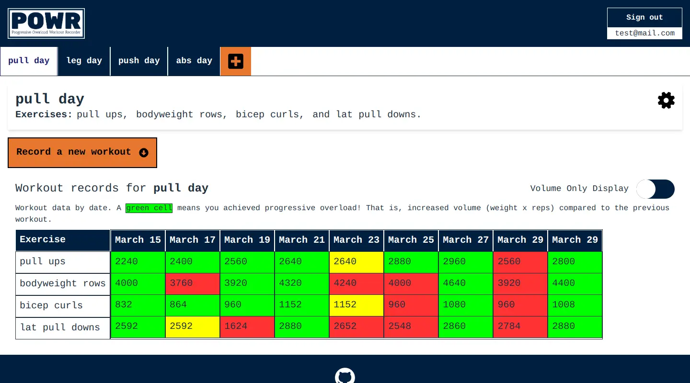

# Progressive Overload Workout Recorder - POWR App

A web app that records workouts so user can track progressive overload.

## The Idea

Gamify your workout routine by striving to achieve progressive overload every workout. The Progressive Overload Workout Recorder saves workout data and displays green when the user increases the volume (weight x reps); that is, achieved progressive overload.

## Screenshot

;

## Sources

Hosting and database by [Firebase](https://firebase.google.com/)

POWR logo created by [Logo](https://logo.com/)

Dumbell favicon from [Icons8](https://icons8.com/icon/BMybI8iktdPI/gym)

Modal slide in animation by [Animista](http://animista.net)

SVG icons from [SVG Repo](https://www.svgrepo.com/) and [React Icons](https://github.com/react-icons/react-icons#readme)
